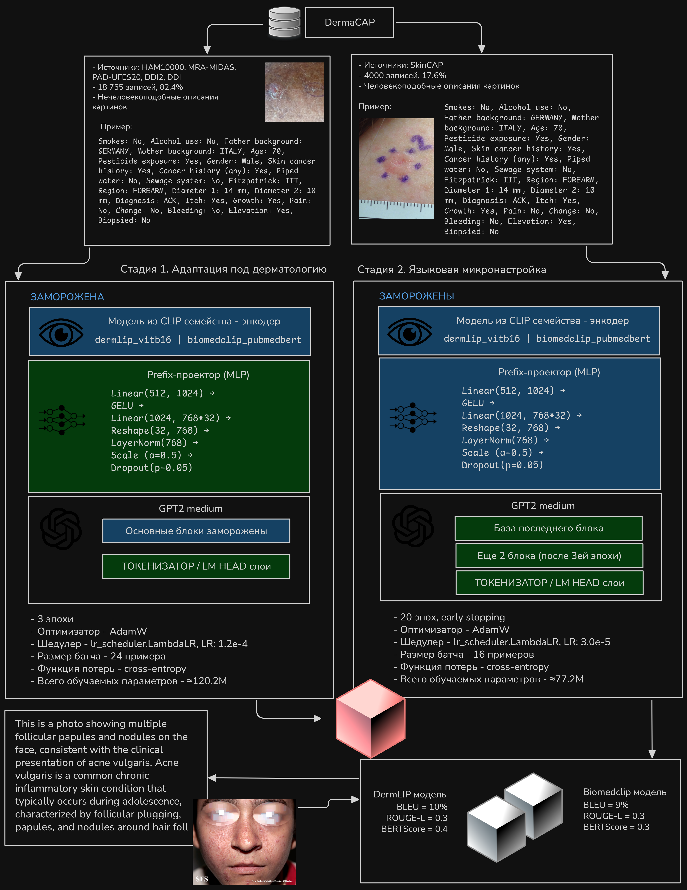
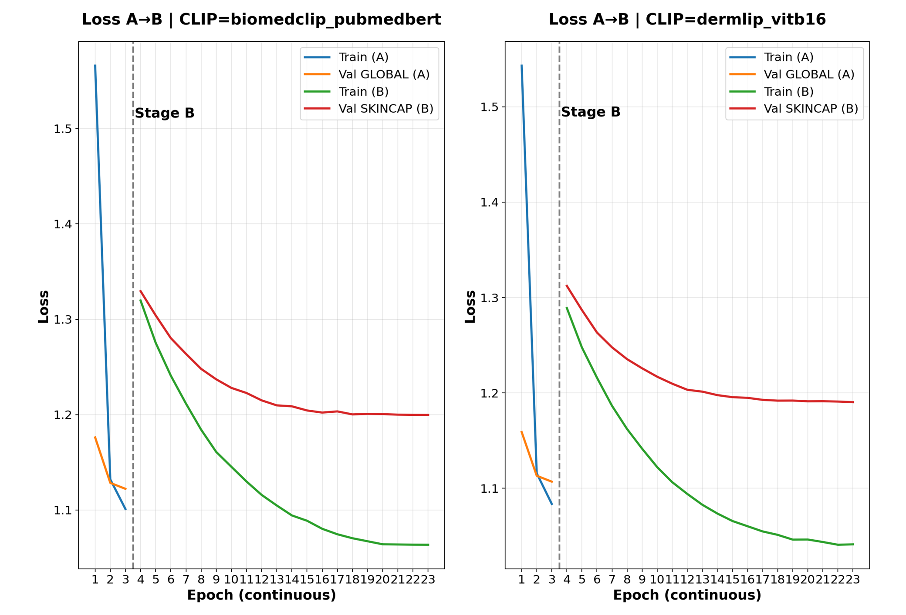

# 🔬 CLIP-XAI: Объяснимые мультимодальные модели для дерматологической диагностики

**Методы объяснения медицинско-специализированных мультимодальных CLIP-моделей для диагностики кожных заболеваний**

*Methods for explaining medical-specialized multimodal CLIP models for skin disease diagnosis*

## Описание проекта

Данный проект представляет комплексный подход к обучению и объяснению мультимодальных CLIP-моделей для диагностики кожных заболеваний. Ключевой особенностью является применение широкого спектра методов **объяснимого искусственного интеллекта (XAI)** для генерации наглядных отчётов с визуальными объяснениями работы модели.

### Ключевые возможности

- **Мультимодальная диагностика** кожных заболеваний
- **Объяснимый ИИ (XAI)** с тепловыми картами и выделением ключевых слов
- **Автоматическое описание изображений** (Image Captioning)
- **Визуализация процесса принятия решений** модели
- **Специализация на медицинских данных** DermaCAP

## Схема обучения

*Схема обучения и применения CLIP-моделей*

Обучение состоит из двух основных стадий:
1. **Стадия 1**: Адаптация под дерматологию с заморозкой энкодеров
2. **Стадия 2**: Языковая микронастройка с разморозкой параметров

## Результаты обучения

### Кривые обучения

*Динамика Loss функций для разных моделей на этапах обучения*

### Сравнение моделей

#### Результаты на общем валидационном наборе
| Модель | BLEU, % | ROUGE-L | BERT_F1 | CLIP Score |
|--------|---------|---------|---------|------------|
| На основе DermLIP | **36.2** | **0.512** | **0.526** | 24.7 |
| На основе BiomedCLIP | 28.4 | 0.422 | 0.405 | **37.6** |

#### Результаты на отложенном наборе SkinCAP
| Модель | BLEU, % | ROUGE-L | BERT_F1 | CLIP Score, % |
|--------|---------|---------|---------|---------------|
| На основе DermLIP | **10.0** | **0.278** | **0.363** | 25.9 |
| На основе BiomedCLIP | 9.3 | 0.267 | 0.348 | **40.5** |

## Датасет DermaCAP

| Набор данных | Количество изображений | Тип данных | Доля в DermaCAP |
|--------------|------------------------|------------|-----------------|
| HAM10000 | 11720 | Фото и метаданные | 51.5% |
| SkinCAP | 4000 | Фото и текстовые описания | 17.6% |
| MRA-MIDAS | 3416 | Фото и метаданные | 15% |
| PAD-UFES-20 | 2298 | Фото и метаданные | 10.1% |
| DDI2 | 665 | Фото и метаданные | 2.92% |
| DDI | 656 | Фото и метаданные | 2.88% |

**Всего: 22,755 изображений с парными описаниями**

## Примеры работы Image Captioner

### Пример анализа кожного заболевания

## XAI Методы и визуализации

### Методы объяснимости

| Метод | Описание | Применение |
|-------|----------|------------|
| **GradCAM** | Градиентно-взвешенная активация карт | Выделение диагностически значимых областей изображения |
| **GradCAM++** | Улучшенная версия GradCAM | Более точная локализация с весовыми коэффициентами |
| **ScoreCAM** | Активационные карты на основе оценок | Локализация без использования градиентов |
| **AblationCAM** | Метод абляции активационных карт | Анализ влияния отдельных регионов на предсказание |
| **Integrated Gradients** | Интегрированные градиенты | Атрибуция важности пикселей с базовой линией |
| **Attention Rollout** | Развертка механизмов внимания | Визуализация flow внимания через слои трансформера |
| **Attention×Gradient** | Произведение внимания и градиентов | Комбинированная атрибуция для трансформеров |
| **GradECLIP** | Градиентные объяснения для CLIP | Специализированный метод для мультимодальных моделей |
| **Token Grad×Input** | Градиенты токенов на входе | Атрибуция важности токенов в тексте |
| **Token Occlusion** | Окклюзия токенов | Анализ влияния отдельных слов на предсказание |
| **KernelSHAP** | SHAP с ядерным подходом | Объяснения на основе теории игр |

### Подробные карточки XAI

*Пример карточки с объяснениями работы модели*

## Требования к системе

- **Python**: 3.8+
- **PyTorch**: 2.0+
- **GPU**: 16GB+ VRAM

## Лицензия

Этот проект распространяется под лицензией MIT. Подробности в файле [LICENSE](LICENSE).

## Контакты

- 📧 **Email**: moxeeeem@gmail.com
- 🤗 **Hugging Face**: [moxeeeem](https://huggingface.co/moxeeeem)
- 🔗 **GitHub**: [moxeeeem](https://github.com/moxeeeem)
