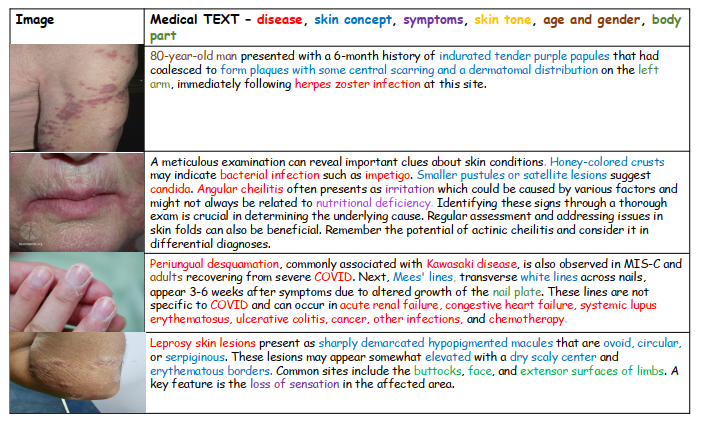
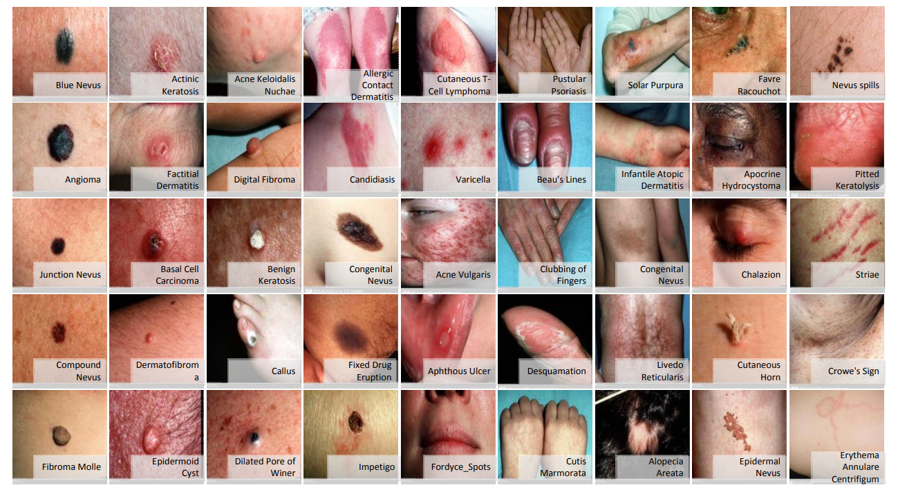
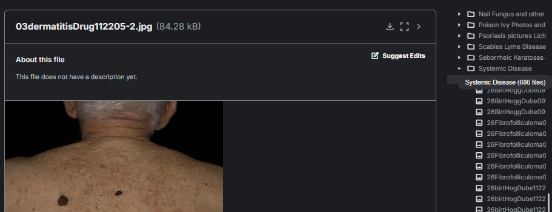
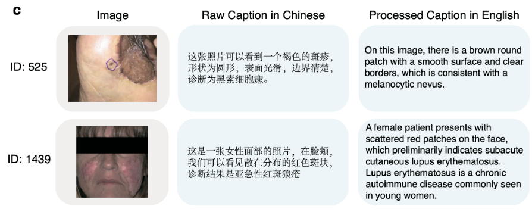
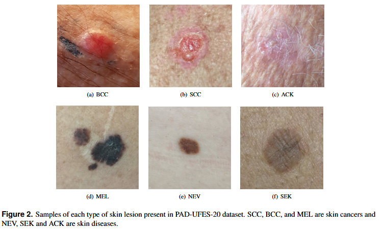

# DermaXAI - Introduction

---

## Paper Name

Название статьи: Методы объяснения медицинско-специализированных мультимодальных CLIP-моделей на примере выявления кожных заболеваний

Более точное название: Использование методов xAI для CLIP-подобных моделей в дерматологии при решении задач Image Captioning

## 1 Goal

Создать прикладное приложение для объяснимого image captioning в дерматологии на базе CLIP-энкодеров с лёгким и доступным текстовым декодером (например, BLIP-2 Q-Former + T5-small): замораживаем визуальный CLIP, обучаем только LoRA на текстовом декодере по дерматологическим датасетам с текстом.

## 2 Nine Source Datasets

### 2.1 Derm1M

**Tasks:**

- Image Classification
- Medical Question Answering (Medical QA)

**Content:**

- IMG + TEXT



**Statistics:**

- пар IMG + TEXT - 1_029_761
- уникальных изображений - 403_563
- количество кожных заболеваний - 390 (4х уровневая иерархия)
- количество клинических понятий - 130
- средняя длина текста - 41 слово

**URL:**

- Ожидается! - [GitHub](https://github.com/SiyuanYan1/Derm1M)

**Paper:**

```bibtex
@misc{yan2025derm1m,
title        = {Derm1M: A Million‑Scale Vision‑Language Dataset Aligned with Clinical Ontology Knowledge for Dermatology},
author       = {Siyuan Yan and Ming Hu and Yiwen Jiang and Xieji Li and Hao Fei and Philipp Tschandl and Harald Kittler and Zongyuan Ge},
year         = {2025},
eprint       = {2503.14911},
archivePrefix= {arXiv},
primaryClass = {cs.CV},
url          = {https://arxiv.org/abs/2503.14911}
}
```

[Paper URL](https://arxiv.org/abs/2503.14911)

### 2.2 SD-198 (Derm7pt)

**Tasks:**

- Image Classification

**Content:**

- IMG+Diagnosis (198)



**Statistics:**

- изображений - 6_584
- кожных заболеваний - 198
- изображений на класс - от 10 до 60 (среднее ≈ 33)

**URL:**

- [Download](https://derm.cs.sfu.ca/restricted/release_v0.zip) (ограниченный доступ)
- [Documentation + Examples](https://github.com/jeremykawahara/derm7pt)

**Paper:**

```bibtex
@article{Kawahara2019-7pt,
author = {Kawahara, Jeremy and Daneshvar, Sara and Argenziano, Giuseppe and Hamarneh, Ghassan},
doi = {10.1109/JBHI.2018.2824327},
journal = {IEEE Journal of Biomedical and Health Informatics},
number = {2},
pages = {538--546},
title = {Seven-point checklist and skin lesion classification using multitask multimodal neural nets},
volume = {23},
year = {2019}
}
```

[Paper URL](http://www.cs.sfu.ca/~hamarneh/ecopy/jbhi2018a.pdf)

### 2.3 HAM10000

**Tasks:**

- Image Classification

**Content:**

- IMG + Diagnosis (7)
- META: возраст, пол, анатомическая зона, дерматоскоп, способ подтверждения диагноза (гистология / follow-up / RCM / эксперт)

**Statistics:**

- изображений - 10_015
- диагнозов - 7 (melanoma, melanocytic nevus, basal cell carcinoma, actinic keratosis / Bowen, benign keratosis, dermatofibroma, vascular lesions)
- ≥ 50 % случаев подтверждены гистологически

**URL:**

- [Download](https://api.isic-archive.com/collections/212/)
- [Dataset Tools](https://github.com/ptschandl/HAM10000_dataset?tab=readme-ov-file)

**Paper:**

```text
Tschandl, P. et al. The HAM10000 dataset, a large collection of multi-source
dermatoscopic images of common pigmented skin lesions. Sci. Data 5:180161 doi: 10.1038/
sdata.2018.161 (2018).

Publisher’s note: Springer Nature remains neutral with regard to jurisdictional claims in published maps
and institutional affiliations.
```

[Paper URL](https://arxiv.org/abs/1803.10417)

### 2.4 DermNet

**Tasks:**

- Image Classification

**Content:**

- Фото
- двухуровневая таксономия: 23 суперкласса → 600+ специфичных заболеваний
- The categories include acne, melanoma, Eczema, Seborrheic Keratoses, Tinea Ringworm, Bullous disease, Poison Ivy, Psoriasis, Vascular Tumors, etc.



**Statistics:**

- Изображений - ≈ 23_000
- Суперклассов - 23
- Подклассов - 600+

**URL:**

- [Kaggle](https://www.kaggle.com/datasets/shubhamgoel27/dermnet)

**Paper:**

- официальной статьи нет
- используют оригинальный ресурс DermNet NZ
- [подробно используется тут](https://www.nature.com/articles/s41598-024-60526-4)

### 2.5 SkinCon

**Tasks:**

- Image Classification

**Content:**

- фото+диагнозы (Actinic keratosis (актиновый кератоз), Basal cell carcinoma (базально-клеточный рак), Benign keratosis (доброкачественный кератоз), Dermatofibroma (дерматофиброма), Melanoma (меланома), Nevus (невус), Squamous cell carcinoma (плоскоклеточный рак), Vascular lesion (сосудистое поражение))
- META пациента

**Statistics:**

- 25 331 изображений
- 8 опухолей

**URL:**

- [Dataset](https://skincon.github.io/)

**Paper:**

```bibtex

@inproceedings{ren2024skincon,
   title={SkinCON: Towards consensus for the uncertainty of skin cancer sub-typing through distribution regularized adaptive predictive sets (DRAPS)},
   author={Ren, Zhihang and Li, Yunqi and Li, Xinyu and Xie, Xinrong and Duhaime, Erik P and Fang, Kathy and Chakraborti, Tapabrata and Guo, Yunhui and Yu, Stella X and Whitney, David},
   booktitle={International Conference on Medical Image Computing and Computer-Assisted Intervention},
   pages={405--415},
   year={2024},
   organization={Springer}
}

```

[Paper URL](https://papers.miccai.org/miccai-2024/paper/4090_paper.pdf)

### 2.6 SkinCAP

**Tasks:**

- Image Captioning
- Image Classification
- Medical Question Answering (Medical QA)

**Content:**

- IMG + Rich Medical Captions



**Statistics:**

- изображений - 4_000
- кожных заболеваний - 178
- средняя длина описания - 53 слова

**URL:**

- [HuggingFace](https://huggingface.co/datasets/joshuachou/SkinCAP)

**Paper:**

```bibtex
@misc{zhou2024skincap,
title        = {SkinCAP: A Multi‑modal Dermatology Dataset Annotated with Rich Medical Captions},
author       = {Juexiao Zhou and Liyuan Sun and Yan Xu and Wenbin Liu and Shawn Afvari and Zhongyi Han and Jiaoyan Song and Yongzhi Ji and Xiaonan He and Xin Gao},
year         = {2024},
eprint       = {2405.18004},
archivePrefix= {arXiv},
primaryClass = {cs.CV},
url          = {https://arxiv.org/abs/2405.18004}
}
```

[Paper URL](https://arxiv.org/abs/2405.18004)

### 2.7 PAD-UFES-20

**Tasks:**

- Image Classification

**Content:**

- Clinical IMG + Diagnosis (6)
- META: 22 клинических признака (возраст, пол, Fitzpatrick, локализация, диаметр и др.)



**Statistics:**

- изображений - 2_298
- пациентов - 1_373
- кожных заболеваний - 6 (ACK, NEV, SEK, BCC, MEL, SCC)
- биопсийно подтверждено - 58.4 %

**URL:**

- [Mendeley Data](https://data.mendeley.com/datasets/zr7vgbcyr2/1)

**Paper:**

```bibtex
@article{pacheco2020padufes,
title        = {PAD-UFES-20: A Skin Lesion Dataset Composed of Patient Data and Clinical Images Collected from Smartphones},
author       = {Pacheco, Andre G. C. and Lima, Gustavo R. and Salomão, Amanda S. and Krohling, Breno A. and Biral, Igor P. and de Angelo, Gabriel G. and Alves Jr, Fábio C. R. and Esgario, José G. M. and Simora, Alana C. and Castro, Pedro B. C. and Rodrigues, Felipe B. and Frasson, Patricia H. L. and Krohling, Renato A. and et al.},
journal      = {Data in Brief},
year         = {2020},
url          = {https://arxiv.org/abs/2007.00478}
}
```

[Paper URL](https://arxiv.org/abs/2007.00478)

### 2.8 BCN20000

**Tasks:**

- Image Classification

**Content:**

- Dermoscopic IMG + Diagnosis (8)

**Statistics:**

- изображений - 19_424
- кожных заболеваний - 8 (melanoma, nevus, BCC, BKL, AKIEC, vascular lesions, dermatofibroma, SCC)
- уникальных кожных поражений - 5_583
- период сбора - 2010–2016

**URL:**

- [ISIC Collection](https://api.isic-archive.com/collections/249/)

**Paper:**

```bibtex
@misc{combalia2019bcn20000,
title        = {BCN20000: Dermoscopic Lesions in the Wild},
author       = {Combalia, Marc and Codella, Noel C. F. and Rotemberg, Veronica and Helba, Brian and Vilaplana, Veronica and Reiter, Ofer and Carrera, Cristina and Barreiro, Alicia and Halpern, Allan C. and Puig, Susana and Malvehy, Josep},
year         = {2019},
eprint       = {1908.02288},
archivePrefix= {arXiv},
primaryClass = {cs.CV},
url          = {https://arxiv.org/abs/1908.02288}
}
```

[Paper URL](https://arxiv.org/abs/1908.02288)

### 2.9 MRA-MIDAS

**Tasks:**

- Multimodal Image Classification
- Lesion Diagnosis

**Content:**

- Dermoscopic + Clinical IMG (15 cm & 30 cm) paired
- META: возраст, пол, анамнез


**Statistics:**

- пациентов - 796
- уникальных поражений - 1_290
- изображений - 3_830
- период сбора - 2020‑08‑18 – 2023‑04‑17
- биопсийно подтверждено ‑ 100 %

**URL:**

- [Dataset Page](https://aimi.stanford.edu/datasets/mra-midas-Multimodal-Image-Dataset-for-AI-based-Skin-Cancer)
- [Direct Download](https://stanfordaimi.azurewebsites.net/)

**Paper:**

```bibtex
@misc{chiou2024midas,
  title        = {MRA-MIDAS: Multimodal Image Dataset for AI-based Skin Cancer},
  author       = {Chiou, Albert S. and Omiye, Jesutofunmi A. and Gui, Haiwen and Swetter, Susan M. and Daneshjou, Roxana and et al.},
  year         = {2024},
  doi          = {10.1101/2024.06.27.24309562},
  archivePrefix= {medRxiv},
  url          = {https://www.medrxiv.org/content/10.1101/2024.06.27.24309562v1}
}
```

[Paper URL](https://www.medrxiv.org/content/10.1101/2024.06.27.24309562v1)

## 3 Source Models

Все модели ниже - **энкодеры**. Для captioning им нужен **прикрученный текстовый декодер** (например, BLIP-2 Q-Former + T5-small). **Полный финетюн не используем**; допускается **LoRA только на декодере**. Визуальный CLIP заморожен.

### 3.1 Medical CLIP Models

1. **DermLIP**  
   - HuggingFace: redlessone/DermLIP_PanDerm-base-w-PubMed-256; redlessone/DermLIP_ViT-B-16  
   - **Генератор:** нужен (BLIP-2/T5-small).  
   - **LoRA:** да, **только на декодере**.  
   - **Датасеты для LoRA:** **SkinCAP** (img+text), **Derm1M**. Дополнительно: слабые текстовые описания из **ISIC Archive / PAD-UFES-20 / BCN20000**.
   - [HuggingFace PanDerm-base](https://huggingface.co/redlessone/DermLIP_PanDerm-base-w-PubMed-256)
   - [HuggingFace ViT-B-16](https://huggingface.co/redlessone/DermLIP_ViT-B-16) - мощнее

2. **MAKE**  
   - HuggingFace: xieji-x/MAKE  
   - **Генератор:** нужен.  
   - **LoRA:** только на декодере.  
   - **Датасеты:** **SkinCAP** (основа), + **Derm1M** (добавка), опционально ISIC/PAD-UFES-20/BCN20000 (слабые подписи).
   - [HuggingFace MAKE](https://huggingface.co/xieji-x/MAKE) - SOTA-качество подписей «из коробки», обучения не требует.
   - нуждается в генераторе (BLIP2/T5, LoRA на декодере)

3. **PanDerm-base**  
   - HuggingFace: redlessone/DermLIP_PanDerm-base-w-PubMed-256 (как backbone PanDerm)  
   - **Генератор:** нужен.  
   - **LoRA:** только на декодере.  
   - **Датасеты:** **SkinCAP**, Derm1M; ISIC/PAD-UFES-20/BCN20000 — для доменной калибровки.
   - [HuggingFace PanDerm-base](https://huggingface.co/redlessone/DermLIP_PanDerm-base-w-PubMed-256) - замораживаем энкодер, ставим BLIP/LLaVA-декодер → достаточно LoRA на тексте.

4. **BiomedCLIP**  
   - HuggingFace: microsoft/BiomedCLIP-PubMedBERT_256-vit_base_patch16_224  
   - **Генератор:** нужен.  
   - **LoRA:** только на декодере.  
   - **Датасеты:** **SkinCAP** (RU/EN фразы), + Derm1M (EN), + ISIC/PAD-UFES-20/BCN20000 (слабые).
   - [HuggingFace BiomedCLIP](https://huggingface.co/microsoft/BiomedCLIP-PubMedBERT_256-vit_base_patch16_224) - широкий мед-CLIP; LoRA на 5-10 k skin-пар обычно достаточно, но полный fine-tune даёт +5-7 % BLEU.

5. **UniMed-CLIP**  
   - HuggingFace: UzairK/unimed-clip-vit-b16  
   - **Генератор:** нужен.  
   - **LoRA:** только на декодере.  
   - **Датасеты:** **SkinCAP**, Derm1M; опционально ISIC/PAD-UFES-20/BCN20000.
   - [HuggingFace UniMed-CLIP](https://huggingface.co/UzairK/unimed-clip-vit-b16) - мультимодален; LoRA под кожу работает, полный fine-tune полезен, если нужны длинные клинические подписи.

### 3.2 Universal CLIP Models

1. **SigLIP (SO400M, ViT-B/14-384)**  
   - HuggingFace: google/siglip-so400m-patch14-384  
   - [HuggingFace SigLIP](https://huggingface.co/google/siglip-so400m-patch14-384)
   - **Генератор:** нужен.  
   - **LoRA:** только на декодере.  
   - **Датасеты:** **SkinCAP** → базовое обучение; Derm1M → донаполнение; ISIC/PAD-UFES-20/BCN20000 → слабые подписи (по желанию).

2. **OpenCLIP (ViT-B/16, ViT-L/14, ViT-H/14)**  
   - HuggingFace: laion/CLIP-* (соответствующие чекпойнты)  
   - [HuggingFace OpenCLIP](https://huggingface.co/laion/CLIP-ViT-H-14-laion2B-s32B-b79K)
   - **Генератор:** нужен.  
   - **LoRA:** только на декодере.  
   - **Датасеты:** **SkinCAP** как основной текстовый источник; Derm1M при наличии; ISIC/PAD-UFES-20/BCN20000 — слабые.

## 4 xAI Methods

### 4.1 Пиксельные методы (качество ↓)

1. **XGrad-CAM** — аксиоматичный CAM, чаще даёт более «чистые» границы очага. Рекомендуется как основной.
   - [Paper](https://arxiv.org/abs/2008.02312)  
   - Добавляет строгие аксиомы важности, благодаря чему подсветка получается резче и точнее очерчивает границу пятна.

2. **Grad-CAM++** — устойчив к нескольким очагам на одном снимке.
   - [Paper](https://arxiv.org/abs/1710.11063)  
   - Строит тепловую карту, умеет выделять несколько очагов на одном снимке (например, два невуса разного типа), что удобно при множественных поражениях.

3. **Grad-CAM** — базовый ориентир/бенчмарк.  
   - [Paper](https://arxiv.org/abs/1610.02391)  
   - Строит тепловую карту, основанную на градиентах, позволяя выделять важные области изображения, но может быть чувствителен к шуму.

4. **Score-CAM** — без градиентов; стабильные карты, но тяжелее и иногда теряет мелкие детали.
   - [Paper](https://arxiv.org/abs/1910.01279)  
   - Работает без градиентов, давая менее шумные и более стабильные карты, но при сложных случаях теряет мелкие детали.

### 4.2 Градиентные методы для CLIP

1. Grad-ECLIP  
   - [Paper](https://arxiv.org/abs/2502.18816)
   - Одновременно подсвечивает пиксели и слова в подписи, связывая фразы («неровная граница», «гиперпигментация») с конкретными участками изображения.  

2. Attention/Attribution Rollout VIT
   - [Paper](https://arxiv.org/abs/2404.14755)  
   - Использует внимательные слои ViT для подсветки, но не всегда даёт точные результаты из-за особенностей архитектуры.
   - Агрегация внимания трансформера CLIP; дешёво, но менее точна.

### 4.3 Концептуальная интерпретация (качество ↓)

1. SpLiCE  
   - [Paper](https://arxiv.org/abs/2402.10376)  
   - Разлагает скрытые вектора CLIP на клинические концепты (цвет, форма, текстура), показывая, что модель опиралась на «тёмно-коричневый цвет» и «асимметрию», а не на фоновые артефакты.

2. ConVis  
   - [Paper](https://arxiv.org/abs/2405.14563)  
   - Позволяет искать произвольный клинический признак; можно запросить «шелушение» и увидеть, поддерживают ли пиксели такую концепцию, даже если она отсутствовала в обучении.
